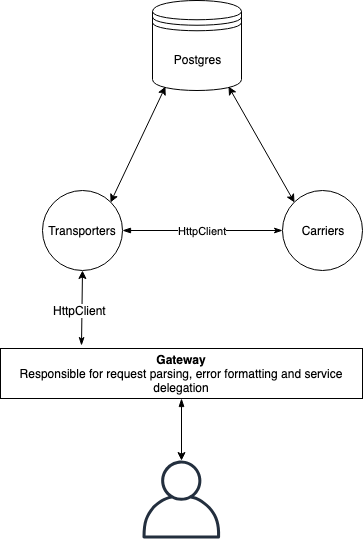

# Colisweb Test

## Basic architecture



Services communicate through HTTP APIs. A gateway pattern is used to expose every endpoint on a common host. This also
enables centralized error formatting regarding badly formatted requests.

## Rationale

- Each service gets an "API" and an "Implementation" project. Each service should be able to call other services through
a unified interface
- I've used the Typelevel stack (cats, cats Effect, http4s and doobie) because I wanted a fully typesafe, purely
functional application. Side effects are restricted to the main method of each service.

## Running the services

### Start a postgres database using docker

```
docker run --name colisweb-postgres -p 5436:5432 postgres:alpine
```

### Start both services

```
sbt transportersImpl/run
```

Transporters service should start on port 8092. Port is customizable through the `TRANSPORTER_SERVICE_PORT` env. variable

```
sbt carriersImpl/run
```

Carriers service should start on port 8091. Port is customizable through the `CARRIERS_SERVICE_PORT` env. variable

### Start the gateway

```
sbt gateway/run
```

Gateway should start on port 8090. Port is customizable through the `GATEWAY_PORT` env. variable

## Deploying

// TODO

## Possible improvements

- Logging : there is currently no log whatsoever
- Gzip Compression
- Unified configuration : replace `sys.env.getOrElse` calls by a true configuration system that should be :
  - type safe
  - shared accross the stack
- Test coverage
- Code duplication : there is a bit of code duplication, especially in the Filters part. There is room for improvement regarding
that segregation of responsibilities and the code duplication.
- Service discovery :
  - Right now services need to be started on a known port at all time. This is not very scalable nor fault-resilient. A
  service discovery system should allow multiple instances of the same service to run on the same machine without explcicitly
  assigning ports beforehand.
